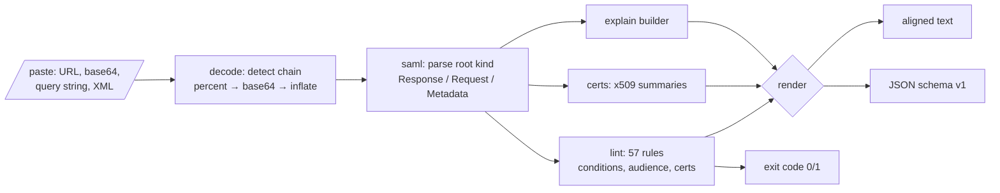

# samlpeek

[English](README.md) | [中文](README.zh.md) | [日本語](README.ja.md)

[](LICENSE) [](go.mod) [](CHANGELOG.md)  [](CONTRIBUTING.md)

**samlpeek：SAML のレスポンス・リクエスト・メタデータをデコードして検査する、オープンソースの依存ゼロ CLI —— base64、DEFLATE、conditions、audience、証明書 —— 完全オフライン。**


```bash
git clone https://github.com/JaydenCJ/samlpeek && cd samlpeek
go build -o samlpeek ./cmd/samlpeek    # single static binary, stdlib only
```

> プレリリース：v0.1.0 はまだパッケージレジストリに公開されていません。上記の手順でソースからビルドしてください（Go ≥1.22 であれば可）。

## なぜ samlpeek？

失敗した SSO ログインのデバッグは、不透明な `SAMLResponse=fZJbT...` の塊を睨んで推測するところから始まります。従来の手順は苦行です：`base64 -d` を手で繋ぎ、Redirect バインディングは raw-DEFLATE 圧縮もされている（`gunzip` では開けない）ことを思い出し、名前空間だらけの XML 二百行から、たった一つの期限切れタイムスタンプや不一致の audience URI を目視で探す。よくある近道——アサーションをオンラインデコーダに貼り付ける——は、ユーザーの氏名・メール・セッション識別子を第三者のサイトに送ってしまいます。samlpeek はすべてをローカルで行います：トランスポートのエンコード連鎖（percent エンコード、4 種すべての base64 アルファベット、raw DEFLATE、zlib、完全なリダイレクト URL）を自動判別し、`Responder/AuthnFailed` が実際に何を意味するかまで平易な言葉で説明し、ログインが失敗する現実的な原因——失効した conditions ウィンドウ、誤った audience、未署名アサーション、SHA-1 署名、期限切れ IdP 証明書、NameID 内コメントのような既知の攻撃形——を 57 のルールで検査します。

| | samlpeek | base64 -d + xmllint | SAML-tracer（ブラウザ拡張） | オンラインデコーダ |
|---|---|---|---|---|
| Redirect バインディング（raw DEFLATE）を展開 | ✅ | ❌ 全部手作業、gunzip では不可 | ✅ | ✅ |
| ステータスコード・conditions・audience を平易に説明 | ✅ | ❌ | ❌ 生 XML 表示のみ | ❌ |
| 検査：期限切れ・audience・署名・証明書・攻撃形 | ✅ 57 ルール | ❌ | ❌ | ❌ |
| URL 貼り付け・ファイル・stdin・クエリ文字列に対応 | ✅ | ❌ | ❌ ライブ取得のみ | 一部 |
| アサーション内の PII が手元から出ない | ✅ オフライン | ✅ | ✅ | ❌ アップロードされる |
| スクリプト化可能（JSON 出力・終了コード） | ✅ | 一部 | ❌ | ❌ |
| ランタイム依存 | 0 | プリインストール | ブラウザ | ウェブサイト |

<sub>2026-07-12 確認：samlpeek は Go 標準ライブラリのみを import し、ネットワーク呼び出しもポートの listen も一切行いません。</sub>

## 機能

- **何を貼ってもデコード** —— 生 XML、base64（パディング有無、標準/url-safe、折り返し込み）、percent エンコードされた blob、完全なリダイレクト URL、`SAMLResponse=…` フォームボディ。適用したステップの連鎖を表示するので、その blob の正体が分かります。
- **平易な言葉の explain** —— 登録済みステータスコードとサブコードを実行可能な文章に翻訳し（`InvalidNameIDPolicy` →「NameIDPolicy を IdP 対応フォーマットに合わせる」）、時間幅つき conditions ウィンドウ、bearer 確認、属性、メタデータのエンドポイントを表示。
- **単なるデコーダではなく linter** —— 57 ルール、kebab-case の固定 ID と重大度つき。`--audience`、`--recipient`、`--destination` で SP 側の期待値を照合。終了コード 1 でスクリプトに組み込めます。
- **決定的な時刻評価** —— `--now` と `--skew` がすべての有効期限チェックを固定。先週火曜に採取したレスポンスを今日検査しても結果は同一で、時計ズレの誤検知も調整で消せます。
- **攻撃形を知っている** —— DTD（XXE ベクタ）や NameID 内の XML コメント（コメント切り詰めなりすまし脆弱性ファミリ）を検出。汎用 XML ツールでは不可視のものです。
- **証明書レントゲン** —— 文書内のすべての X.509 blob を展開：サブジェクト、有効期間、残日数、鍵長、SHA-256 フィンガープリント。メタデータ証明書は期限 30 日前に警告。
- **依存ゼロ・完全オフライン** —— Go 標準ライブラリのみ。ユーザー PII を含むアサーションはマシンの外に出ません。テレメトリなし、通信は一切なし。

## クイックスタート

```bash
go build -o samlpeek ./cmd/samlpeek
./samlpeek explain --now 2026-07-12T09:01:00Z examples/response-post.b64
```

実際に取得した出力：

```text
samlpeek — SAML Response (http-post)
decode: base64 (standard) → already XML, 3771 bytes of XML

Response
  ID             _resp-7f3d9a12
  IssueInstant   2026-07-12T09:00:00Z
  Issuer         https://idp.example.test/saml
  Destination    https://sp.example.test/saml/acs
  InResponseTo   _authnreq-42
  Status         Success — the request succeeded
  Signed         no

Assertion _assert-91af
  Issuer         https://idp.example.test/saml
  Signed         yes (rsa-sha256 / sha256), cert CN=idp.example.test expires 2035-01-01
  Subject        alice@example.test  [emailAddress]
  Confirmation   bearer → https://sp.example.test/saml/acs, valid until 2026-07-12T09:05:00Z, answers _authnreq-42
  Conditions     2026-07-12T08:55:00Z → 2026-07-12T09:05:00Z  (window 10m)
  Audience       https://sp.example.test
  AuthnContext   PasswordProtectedTransport at 2026-07-12T08:59:58Z  (session _sess-91af)
  Attributes (3)
    email        alice@example.test
    displayName  Alice Example
    groups       admins, engineers
```

6 か所壊れたレスポンスを lint（`examples/bad-response.b64`、実際の出力）：

```text
samlpeek lint — SAML Response, evaluated at 2026-07-12T09:01:00Z (skew 1m30s)

ERROR  assertion-expired            Conditions NotOnOrAfter 2026-07-11T09:05:00Z is 23h56m in the past; the assertion is dead — re-test with a fresh login
ERROR  bearer-expired               bearer NotOnOrAfter 2026-07-11T09:05:00Z is 23h56m in the past; the SP will reject this assertion
ERROR  certificate-expired          Assertion signature certificate CN=old-idp.example.test,O=Example Test IdP expired 2021-01-01 (2018d9h ago)
ERROR  nameid-comment               NameID "alice@example.test.attacker.test" contains an XML comment; comment-truncation bugs in several SAML stacks let attackers impersonate other users this way — reject this message
WARN   bearer-no-recipient          bearer SubjectConfirmationData has no Recipient; the SP cannot verify the assertion was addressed to its ACS URL
WARN   no-audience-restriction      Conditions has no AudienceRestriction; the assertion can be replayed to any SP that trusts this IdP
WARN   weak-digest-algorithm        Assertion digest uses sha1; move the IdP to sha256
WARN   weak-signature-algorithm     Assertion is signed with rsa-sha1; SHA-1 signatures are deprecated — move the IdP to rsa-sha256
INFO   response-not-signed          Response element itself is unsigned (the assertion is signed, which most SPs accept)

4 errors, 4 warnings, 1 info — FAIL
```

アドレスバーからコピーしたリダイレクト URL もそのまま使えます —— samlpeek が抽出・percent デコード・base64 デコード・解凍まで行います：

```bash
./samlpeek explain "$(cat examples/redirect-request.txt)"   # 実際のアドレスバー URL
```

## CLI リファレンス

`samlpeek <decode|explain|lint|certs|version> [flags] [file|-|payload]` —— 入力はファイル、stdin、または貼り付けたペイロードそのもの。終了コード：0 正常/合格、1 lint 検出あり、2 使い方の誤り、3 デコード不能な入力。

| フラグ | デフォルト | 効果 |
|---|---|---|
| `--format` | `text` | explain / lint / certs の出力を `text` または `json`（`schema_version: 1`）に |
| `--now` | 現在時刻 | すべての有効期限チェックに使う RFC3339 の評価時刻 |
| `--skew`（lint） | `90s` | 期限系ルールが発火するまでに許す時計のズレ |
| `--audience`（lint） | — | 期待する SP entity ID；AudienceRestriction を照合 |
| `--recipient`（lint） | — | 期待する ACS URL；bearer Recipient を照合 |
| `--destination`（lint） | — | 期待する Destination 属性 |
| `--strict`（lint） | オフ | エラーだけでなく警告でも終了コード 1 |
| `--pretty`（decode） | オフ | 字句レベルの再インデント；プレフィックスも内容も書き換えない |

## Lint ルール

固定 ID の 57 ルール。完全なドキュメントは [docs/lint-rules.md](docs/lint-rules.md)。正直な注記：samlpeek は署名アルゴリズム・カバレッジ・証明書を検査しますが、XML-DSig の検証は**行いません**——正準化まで正しい検証は SAML スタックの仕事であり、デバッグツールができるふりをすれば偽の安心を教えるだけです。暗号化アサーションは正直にそう報告し、黙って飛ばすことはありません。

## 検証

このリポジトリは CI を同梱しません。上記の主張はすべてローカル実行で検証しています：

```bash
go test ./...            # 90 個の決定的テスト、オフライン、5 秒未満
bash scripts/smoke.sh    # エンドツーエンドの CLI チェック、SMOKE OK を出力
```

## アーキテクチャ



## ロードマップ

- [x] v0.1.0 —— トランスポート自動デコード（base64/DEFLATE/zlib/URL）、6 種の文書タイプ、平易な explain、57 の lint ルール（`--now`/`--skew` 付き）、証明書レントゲン、JSON 出力、90 テスト + smoke スクリプト
- [ ] XML-DSig 署名検証（exclusive c14n）を明示的な `verify` サブコマンドとして
- [ ] SP 秘密鍵を与えての EncryptedAssertion 復号（`--key sp.pem`）
- [ ] `diff` サブコマンド：2 つのレスポンス / メタデータをフィールド単位で比較
- [ ] Watch モード：IdP 設定の試行錯誤向けの貼り付け即 lint ループ
- [ ] SAML 1.1 と WS-Federation メッセージの認識（explain のみ）

全リストは [open issues](https://github.com/JaydenCJ/samlpeek/issues) を参照してください。

## コントリビュート

Issue・ディスカッション・PR を歓迎します —— ローカルの作業フロー（フォーマット、vet、テスト、`SMOKE OK`）は [CONTRIBUTING.md](CONTRIBUTING.md) を参照。入門タスクは [good first issue](https://github.com/JaydenCJ/samlpeek/issues?q=is%3Aissue+is%3Aopen+label%3A%22good+first+issue%22) ラベル、設計の議論は [Discussions](https://github.com/JaydenCJ/samlpeek/discussions) へ。

## ライセンス

[MIT](LICENSE)
