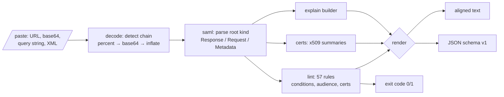

# samlpeek

[English](README.md) | [中文](README.zh.md) | [日本語](README.ja.md)

[](LICENSE) [](go.mod) [](CHANGELOG.md)  [](CONTRIBUTING.md)

**samlpeek：an open-source, zero-dependency CLI that decodes and lints SAML responses, requests, and metadata — base64, DEFLATE, conditions, audience, certificates — entirely offline.**


```bash
git clone https://github.com/JaydenCJ/samlpeek && cd samlpeek
go build -o samlpeek ./cmd/samlpeek    # single static binary, stdlib only
```

> Pre-release: v0.1.0 is not tagged on a package registry yet; build from source as above (any Go ≥1.22).

## Why samlpeek?

Debugging a failed SSO login means staring at an opaque `SAMLResponse=fZJbT...` blob and guessing. The usual workflow is miserable: hand-chain `base64 -d`, remember that the Redirect binding also raw-DEFLATEs (which `gunzip` refuses to open), then eyeball two hundred lines of namespaced XML for the one expired timestamp or mismatched audience URI. The popular shortcut — pasting the assertion into an online decoder — ships your users' names, emails, and session identifiers to a third-party website. samlpeek does the whole job locally: it auto-detects the transport chain (percent-encoding, all four base64 alphabets, raw DEFLATE, zlib, full redirect URLs), explains the message in plain language including what `Responder/AuthnFailed` actually means, and lints it against 57 rules covering the real reasons logins fail — dead conditions windows, wrong audience, unsigned assertions, SHA-1 signatures, expired IdP certificates, and known attack shapes like comments inside NameID.

| | samlpeek | base64 -d + xmllint | SAML-tracer (browser ext.) | online decoders |
|---|---|---|---|---|
| Inflates Redirect-binding (raw DEFLATE) payloads | ✅ | ❌ manual, and gunzip can't | ✅ | ✅ |
| Explains status codes, conditions, audience in plain language | ✅ | ❌ | ❌ raw XML view | ❌ |
| Lints: expiry, audience, signatures, certificates, attack shapes | ✅ 57 rules | ❌ | ❌ | ❌ |
| Works on pasted URLs, files, stdin, query strings | ✅ | ❌ | ❌ live capture only | partial |
| Assertion PII stays on your machine | ✅ offline | ✅ | ✅ | ❌ uploaded |
| Scriptable (JSON output, exit codes) | ✅ | partial | ❌ | ❌ |
| Runtime dependencies | 0 | preinstalled | a browser | a website |

<sub>Checked 2026-07-12: samlpeek imports the Go standard library only; it makes no network calls and binds nothing.</sub>

## Features

- **Paste-anything decoder** — raw XML, base64 (padded or not, standard or url-safe, whitespace-wrapped), percent-encoded blobs, full redirect URLs, or `SAMLResponse=…` form bodies; the applied step chain is shown, so you learn what the blob was.
- **Plain-language explain** — registered status codes and sub-codes translated into actionable sentences (`InvalidNameIDPolicy` → "align NameIDPolicy with the IdP's supported formats"), conditions windows with durations, bearer confirmations, attributes, metadata endpoints.
- **A linter, not just a decoder** — 57 rules with stable kebab-case IDs and severities; `--audience`, `--recipient`, `--destination` check your SP's expectations; exit code 1 makes it scriptable.
- **Deterministic time evaluation** — `--now` and `--skew` pin every validity check, so a captured response from last Tuesday lints identically today, and clock-drift false positives are tunable away.
- **Attack-shape aware** — flags DTDs (XXE vector) and XML comments inside NameID (the comment-truncation impersonation bug family) that generic XML tools render invisible.
- **Certificate x-ray** — every embedded X.509 blob decoded: subject, validity, days left, key size, SHA-256 fingerprint; expiring metadata certs warn 30 days out.
- **Zero dependencies, fully offline** — Go standard library only; assertions carrying user PII never leave the machine. No telemetry, no network, ever.

## Quickstart

```bash
go build -o samlpeek ./cmd/samlpeek
./samlpeek explain --now 2026-07-12T09:01:00Z examples/response-post.b64
```

Real captured output:

```text
samlpeek — SAML Response (http-post)
decode: base64 (standard) → already XML, 3771 bytes of XML

Response
  ID             _resp-7f3d9a12
  IssueInstant   2026-07-12T09:00:00Z
  Issuer         https://idp.example.test/saml
  Destination    https://sp.example.test/saml/acs
  InResponseTo   _authnreq-42
  Status         Success — the request succeeded
  Signed         no

Assertion _assert-91af
  Issuer         https://idp.example.test/saml
  Signed         yes (rsa-sha256 / sha256), cert CN=idp.example.test expires 2035-01-01
  Subject        alice@example.test  [emailAddress]
  Confirmation   bearer → https://sp.example.test/saml/acs, valid until 2026-07-12T09:05:00Z, answers _authnreq-42
  Conditions     2026-07-12T08:55:00Z → 2026-07-12T09:05:00Z  (window 10m)
  Audience       https://sp.example.test
  AuthnContext   PasswordProtectedTransport at 2026-07-12T08:59:58Z  (session _sess-91af)
  Attributes (3)
    email        alice@example.test
    displayName  Alice Example
    groups       admins, engineers
```

Lint a response that is broken in six different ways (`examples/bad-response.b64`, real output):

```text
samlpeek lint — SAML Response, evaluated at 2026-07-12T09:01:00Z (skew 1m30s)

ERROR  assertion-expired            Conditions NotOnOrAfter 2026-07-11T09:05:00Z is 23h56m in the past; the assertion is dead — re-test with a fresh login
ERROR  bearer-expired               bearer NotOnOrAfter 2026-07-11T09:05:00Z is 23h56m in the past; the SP will reject this assertion
ERROR  certificate-expired          Assertion signature certificate CN=old-idp.example.test,O=Example Test IdP expired 2021-01-01 (2018d9h ago)
ERROR  nameid-comment               NameID "alice@example.test.attacker.test" contains an XML comment; comment-truncation bugs in several SAML stacks let attackers impersonate other users this way — reject this message
WARN   bearer-no-recipient          bearer SubjectConfirmationData has no Recipient; the SP cannot verify the assertion was addressed to its ACS URL
WARN   no-audience-restriction      Conditions has no AudienceRestriction; the assertion can be replayed to any SP that trusts this IdP
WARN   weak-digest-algorithm        Assertion digest uses sha1; move the IdP to sha256
WARN   weak-signature-algorithm     Assertion is signed with rsa-sha1; SHA-1 signatures are deprecated — move the IdP to rsa-sha256
INFO   response-not-signed          Response element itself is unsigned (the assertion is signed, which most SPs accept)

4 errors, 4 warnings, 1 info — FAIL
```

A redirect URL pasted straight from the address bar also works — samlpeek extracts, percent-decodes, base64-decodes, and inflates it:

```bash
./samlpeek explain "$(cat examples/redirect-request.txt)"   # a real address-bar URL
```

## CLI reference

`samlpeek <decode|explain|lint|certs|version> [flags] [file|-|payload]` — input may be a file, stdin, or the pasted payload itself. Exit codes: 0 ok/pass, 1 lint findings, 2 usage error, 3 undecodable input.

| Flag | Default | Effect |
|---|---|---|
| `--format` | `text` | `text` or `json` (`schema_version: 1`) for explain / lint / certs |
| `--now` | current time | RFC3339 evaluation instant for every validity check |
| `--skew` (lint) | `90s` | allowed clock drift before expiry rules fire |
| `--audience` (lint) | — | expected SP entity ID; checks AudienceRestriction |
| `--recipient` (lint) | — | expected ACS URL; checks bearer Recipient |
| `--destination` (lint) | — | expected Destination attribute |
| `--strict` (lint) | off | exit 1 on warnings too, not just errors |
| `--pretty` (decode) | off | lexical re-indent; never rewrites prefixes or values |

## Lint rules

57 rules with stable IDs, documented in [docs/lint-rules.md](docs/lint-rules.md). Honesty note: samlpeek inspects signature algorithms, coverage, and certificates but does **not** verify XML-DSig — canonicalization-correct verification belongs to your SAML stack, and a debugging tool pretending otherwise would teach false confidence. Encrypted assertions are reported as such, never silently skipped.

## Verification

This repository ships no CI; every claim above is verified by local runs:

```bash
go test ./...            # 90 deterministic tests, offline, < 5 s
bash scripts/smoke.sh    # end-to-end CLI check, prints SMOKE OK
```

## Architecture



## Roadmap

- [x] v0.1.0 — transport auto-decoder (base64/DEFLATE/zlib/URL), six document kinds, plain-language explain, 57 lint rules with `--now`/`--skew`, certificate x-ray, JSON output, 90 tests + smoke script
- [ ] XML-DSig signature verification (exclusive c14n) behind an explicit `verify` subcommand
- [ ] EncryptedAssertion decryption given an SP private key (`--key sp.pem`)
- [ ] `diff` subcommand: compare two responses / metadata documents field by field
- [ ] Watch mode: paste-and-lint loop for iterating on IdP configuration
- [ ] SAML 1.1 and WS-Federation message recognition (explain-only)

See the [open issues](https://github.com/JaydenCJ/samlpeek/issues) for the full list.

## Contributing

Issues, discussions and pull requests are welcome — see [CONTRIBUTING.md](CONTRIBUTING.md) for the local workflow (format, vet, tests, `SMOKE OK`). Good entry points are labelled [good first issue](https://github.com/JaydenCJ/samlpeek/issues?q=is%3Aissue+is%3Aopen+label%3A%22good+first+issue%22), and design questions live in [Discussions](https://github.com/JaydenCJ/samlpeek/discussions).

## License

[MIT](LICENSE)
