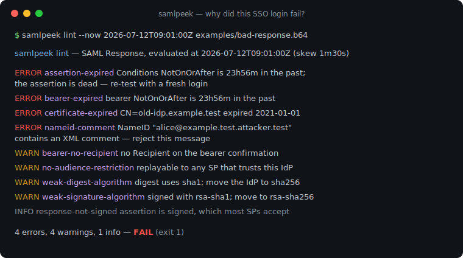
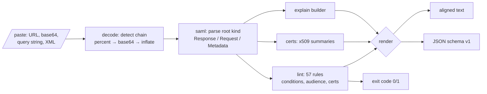

# samlpeek

[English](README.md) | [中文](README.zh.md) | [日本語](README.ja.md)

[](LICENSE) [](go.mod) [](CHANGELOG.md)  [](CONTRIBUTING.md)

**samlpeek：开源、零依赖的 CLI，解码并检查 SAML 响应、请求与元数据 —— base64、DEFLATE、conditions、audience、证书 —— 完全离线。**



```bash
git clone https://github.com/JaydenCJ/samlpeek && cd samlpeek
go build -o samlpeek ./cmd/samlpeek    # single static binary, stdlib only
```

> 预发布说明：v0.1.0 尚未发布到任何包仓库；请按上述方式从源码构建（任意 Go ≥1.22 即可）。

## 为什么选 samlpeek？

调试一次失败的 SSO 登录，往往从盯着一坨不透明的 `SAMLResponse=fZJbT...` 开始瞎猜。常规流程很痛苦：手工串联 `base64 -d`，还得记住 Redirect 绑定额外做了 raw-DEFLATE 压缩（`gunzip` 拒绝解开），然后在两百行带命名空间的 XML 里肉眼寻找那一个过期的时间戳或不匹配的 audience URI。更流行的捷径——把断言粘贴到在线解码网站——则把你用户的姓名、邮箱和会话标识送给了第三方。samlpeek 在本地完成全部工作：自动识别传输编码链（percent 编码、全部四种 base64 字母表、raw DEFLATE、zlib、完整重定向 URL），用大白话解释报文内容（包括 `Responder/AuthnFailed` 到底意味着什么），并用 57 条规则检查登录失败的真实原因——失效的 conditions 窗口、错误的 audience、未签名的断言、SHA-1 签名、过期的 IdP 证书，以及 NameID 内嵌注释这类已知攻击形态。

| | samlpeek | base64 -d + xmllint | SAML-tracer（浏览器扩展） | 在线解码网站 |
|---|---|---|---|---|
| 解开 Redirect 绑定（raw DEFLATE）载荷 | ✅ | ❌ 全手工，且 gunzip 打不开 | ✅ | ✅ |
| 用大白话解释状态码、conditions、audience | ✅ | ❌ | ❌ 只有原始 XML | ❌ |
| 检查：过期、audience、签名、证书、攻击形态 | ✅ 57 条规则 | ❌ | ❌ | ❌ |
| 支持粘贴 URL、文件、stdin、query string | ✅ | ❌ | ❌ 仅实时抓包 | 部分支持 |
| 断言中的 PII 不出本机 | ✅ 离线 | ✅ | ✅ | ❌ 会上传 |
| 可脚本化（JSON 输出、退出码） | ✅ | 部分 | ❌ | ❌ |
| 运行时依赖 | 0 | 系统自带 | 一个浏览器 | 一个网站 |

<sub>核查于 2026-07-12：samlpeek 只引入 Go 标准库；不发起任何网络调用，也不监听任何端口。</sub>

## 功能特性

- **随便粘贴都能解** —— 原始 XML、base64（有无 padding、标准或 url-safe 字母表、带换行折行）、percent 编码 blob、完整重定向 URL、`SAMLResponse=…` 表单体；解码步骤链会完整展示，让你搞清这坨 blob 到底是什么。
- **大白话 explain** —— 把注册的状态码与子码翻译成可执行的句子（`InvalidNameIDPolicy` →「让 NameIDPolicy 与 IdP 支持的格式对齐」），并展示带时长的 conditions 窗口、bearer 确认、属性、元数据端点。
- **是 linter，不只是解码器** —— 57 条规则，ID 固定为 kebab-case 并带严重级别；`--audience`、`--recipient`、`--destination` 校验你 SP 侧的预期；退出码 1 让它可以进脚本。
- **确定性的时间评估** —— `--now` 与 `--skew` 固定所有有效期检查，上周二抓的响应今天检查结果完全一致，时钟漂移误报也可调走。
- **认识攻击形态** —— 标记 DTD（XXE 向量）与 NameID 内的 XML 注释（注释截断冒充漏洞家族），这些在通用 XML 工具里根本不可见。
- **证书透视** —— 解开文档里每一个 X.509 blob：主体、有效期、剩余天数、密钥长度、SHA-256 指纹；元数据证书临期 30 天内即告警。
- **零依赖、完全离线** —— 仅 Go 标准库；携带用户 PII 的断言永不出本机。没有遥测，永不联网。

## 快速上手

```bash
go build -o samlpeek ./cmd/samlpeek
./samlpeek explain --now 2026-07-12T09:01:00Z examples/response-post.b64
```

真实截取的输出：

```text
samlpeek — SAML Response (http-post)
decode: base64 (standard) → already XML, 3771 bytes of XML

Response
  ID             _resp-7f3d9a12
  IssueInstant   2026-07-12T09:00:00Z
  Issuer         https://idp.example.test/saml
  Destination    https://sp.example.test/saml/acs
  InResponseTo   _authnreq-42
  Status         Success — the request succeeded
  Signed         no

Assertion _assert-91af
  Issuer         https://idp.example.test/saml
  Signed         yes (rsa-sha256 / sha256), cert CN=idp.example.test expires 2035-01-01
  Subject        alice@example.test  [emailAddress]
  Confirmation   bearer → https://sp.example.test/saml/acs, valid until 2026-07-12T09:05:00Z, answers _authnreq-42
  Conditions     2026-07-12T08:55:00Z → 2026-07-12T09:05:00Z  (window 10m)
  Audience       https://sp.example.test
  AuthnContext   PasswordProtectedTransport at 2026-07-12T08:59:58Z  (session _sess-91af)
  Attributes (3)
    email        alice@example.test
    displayName  Alice Example
    groups       admins, engineers
```

对一份坏了六处的响应做 lint（`examples/bad-response.b64`，真实输出）：

```text
samlpeek lint — SAML Response, evaluated at 2026-07-12T09:01:00Z (skew 1m30s)

ERROR  assertion-expired            Conditions NotOnOrAfter 2026-07-11T09:05:00Z is 23h56m in the past; the assertion is dead — re-test with a fresh login
ERROR  bearer-expired               bearer NotOnOrAfter 2026-07-11T09:05:00Z is 23h56m in the past; the SP will reject this assertion
ERROR  certificate-expired          Assertion signature certificate CN=old-idp.example.test,O=Example Test IdP expired 2021-01-01 (2018d9h ago)
ERROR  nameid-comment               NameID "alice@example.test.attacker.test" contains an XML comment; comment-truncation bugs in several SAML stacks let attackers impersonate other users this way — reject this message
WARN   bearer-no-recipient          bearer SubjectConfirmationData has no Recipient; the SP cannot verify the assertion was addressed to its ACS URL
WARN   no-audience-restriction      Conditions has no AudienceRestriction; the assertion can be replayed to any SP that trusts this IdP
WARN   weak-digest-algorithm        Assertion digest uses sha1; move the IdP to sha256
WARN   weak-signature-algorithm     Assertion is signed with rsa-sha1; SHA-1 signatures are deprecated — move the IdP to rsa-sha256
INFO   response-not-signed          Response element itself is unsigned (the assertion is signed, which most SPs accept)

4 errors, 4 warnings, 1 info — FAIL
```

从地址栏直接复制的重定向 URL 也能用 —— samlpeek 会自动提取、percent 解码、base64 解码并解压：

```bash
./samlpeek explain "$(cat examples/redirect-request.txt)"   # 真实的地址栏 URL
```

## CLI 参考

`samlpeek <decode|explain|lint|certs|version> [flags] [file|-|payload]` —— 输入可以是文件、stdin，或直接粘贴的载荷本身。退出码：0 正常/通过，1 lint 有发现，2 用法错误，3 输入无法解码。

| 参数 | 默认值 | 作用 |
|---|---|---|
| `--format` | `text` | explain / lint / certs 输出 `text` 或 `json`（`schema_version: 1`） |
| `--now` | 当前时间 | 所有有效期检查使用的 RFC3339 评估时刻 |
| `--skew`（lint） | `90s` | 过期类规则触发前允许的时钟漂移 |
| `--audience`（lint） | — | 预期的 SP entity ID；校验 AudienceRestriction |
| `--recipient`（lint） | — | 预期的 ACS URL；校验 bearer Recipient |
| `--destination`（lint） | — | 预期的 Destination 属性 |
| `--strict`（lint） | 关 | 警告也返回退出码 1，而不仅是错误 |
| `--pretty`（decode） | 关 | 词法级重排缩进；绝不改写前缀或内容 |

## Lint 规则

57 条规则，ID 固定，完整文档见 [docs/lint-rules.md](docs/lint-rules.md)。诚实声明：samlpeek 检查签名算法、覆盖范围与证书，但**不做** XML-DSig 验签——规范化正确的验签属于你的 SAML 协议栈，调试工具假装会做只会制造虚假信心。加密断言会如实报告，绝不悄悄跳过。

## 验证

本仓库不带 CI；上面的每一条声明都由本地运行验证：

```bash
go test ./...            # 90 个确定性测试，离线，< 5 秒
bash scripts/smoke.sh    # 端到端 CLI 检查，输出 SMOKE OK
```

## 架构



## 路线图

- [x] v0.1.0 —— 传输自动解码（base64/DEFLATE/zlib/URL）、六种文档类型、大白话 explain、57 条 lint 规则（含 `--now`/`--skew`）、证书透视、JSON 输出、90 个测试 + smoke 脚本
- [ ] XML-DSig 验签（exclusive c14n），放在显式的 `verify` 子命令后面
- [ ] 提供 SP 私钥时解密 EncryptedAssertion（`--key sp.pem`）
- [ ] `diff` 子命令：逐字段对比两份响应 / 元数据文档
- [ ] Watch 模式：粘贴即 lint 的循环，方便迭代 IdP 配置
- [ ] 识别 SAML 1.1 与 WS-Federation 报文（仅 explain）

完整列表见 [open issues](https://github.com/JaydenCJ/samlpeek/issues)。

## 参与贡献

欢迎 issue、讨论与 PR —— 本地工作流（格式化、vet、测试、`SMOKE OK`）见 [CONTRIBUTING.md](CONTRIBUTING.md)。入门任务标注为 [good first issue](https://github.com/JaydenCJ/samlpeek/issues?q=is%3Aissue+is%3Aopen+label%3A%22good+first+issue%22)，设计讨论在 [Discussions](https://github.com/JaydenCJ/samlpeek/discussions)。

## 许可证

[MIT](LICENSE)
